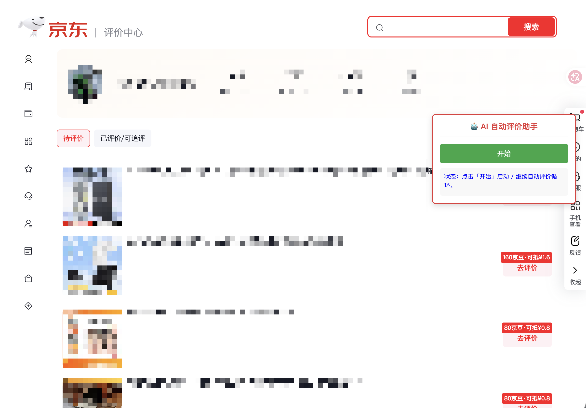

# 京东AI评价助手（全自动闭环）

一个 Tampermonkey 油猴脚本：在京东新版评价中心自动完成「生成评价 → 打五星 → 配图 → 发表 → 下一单」的循环，直到待评列表清空，全程由一个「开始 / 暂停」按钮控制。

---

## 使用教程

### 1. 安装

1. 浏览器安装 [Tampermonkey](https://www.tampermonkey.net/) 扩展。
2. 下载本仓库的 [`jd-auto-review.user.js`](https://github.com/yupaiLy/jd-auto-review/raw/main/jd-auto-review.user.js)，打开 Tampermonkey → **管理面板 → 实用工具 → 导入**，选择该文件；或 Tampermonkey → **「＋」新建脚本**，粘贴全文保存。

### 2. 配置

编辑脚本顶部「🛠️ 用户配置区域」，**至少填好 `API_KEY`**：

| 配置项 | 默认值 | 说明 |
|--------|--------|------|
| `API_KEY` | `'sk-xxx'`（**必填**，替换为真实密钥） | 大模型 API 密钥 |
| `API_URL` | `https://api.deepseek.com/v1/chat/completions` | 默认 DeepSeek 官方接口，可替换为其他 OpenAI 兼容地址 |
| `MODEL_NAME` | `deepseek-flash` | 模型名 |
| `AUTO_CLICK_DELAY` | `3000` | 各环节自动点击前的等待（毫秒） |
| `ENABLE_IMAGE` | `true` | 是否自动配图 |
| `IMG_PER_PRODUCT` | `'3-5'` | 每个商品配图张数，支持固定数字（如 `2`）或区间随机（如 `'3-5'`，每个商品单独随机） |
| `UPLOAD_WAIT_TIMEOUT` | `12000` | 配图上传完成的最长等待（毫秒） |

> ⚠️ 不要把填好真实 `API_KEY` 的版本提交到 git 或分享出去。

> ⚠️ **更换大模型接口必读**：脚本头部用 `@connect` 声明了跨域请求白名单（当前为 `api.deepseek.com`、`club.jd.com`、`360buyimg.com`，分别对应大模型请求、晒单图接口、图片下载）。如果 `API_URL` 不使用默认的 DeepSeek，而是换成其他服务商（OpenAI、智谱、自建网关等），必须同步在脚本头部加一行 `// @connect <新接口域名>`，否则 Tampermonkey 会拦截大模型请求，表现为「评价生成一直失败」。

### 3. 运行

1. 浏览器**登录京东账号**，打开评价中心：<https://comment.m.jd.com/pc-static/center>。
2. 页面右侧出现「🤖 AI 自动评价助手」浮窗，点击 **开始**，脚本自动循环：

   点「评价」→ 大模型逐商品生成评价并回填 → 统一打五星 → 抓取买家晒单图随机上传（可关）→ 点「发表」→ 返回待评价列表 → 进入下一单；**待评列表清空后自动停止**。

3. 任意时刻点 **暂停**：当前步骤完成后停下；再点 **开始** 从断点继续。循环状态跨页面跳转保持（`localStorage`）。

### 注意事项

- 首次使用建议先盯**一单**走完整流程，确认「评价回填、星级点亮、发表成功、返回列表」都正常，再放开循环。
- 送装/服务类评价页暂不支持自动填写，脚本会自动跳过该单继续下一单。
- 大模型生成失败时脚本会暂停并提示原因，排查后点「开始」重试当前商品。
- 未登录时点「开始」会被拦截提示，请先登录京东。
- 京东随时可能改版，脚本选择器失效时需同步更新。

---

## 免责声明

本脚本仅供个人学习与自动化技术研究。使用本脚本自动生成、提交商品评价（尤其是统一好评与非本人拍摄的配图），**可能违反京东平台用户协议、涉及评价真实性与消费者知情权问题，并可能导致账号被风控、限制或封禁**。是否使用、如何使用由使用者自行决定，作者不对由此产生的任何账号、法律或其他后果负责。请遵守平台规则与当地法律法规。
